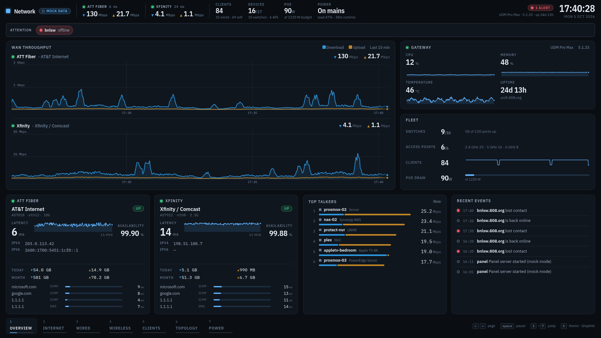
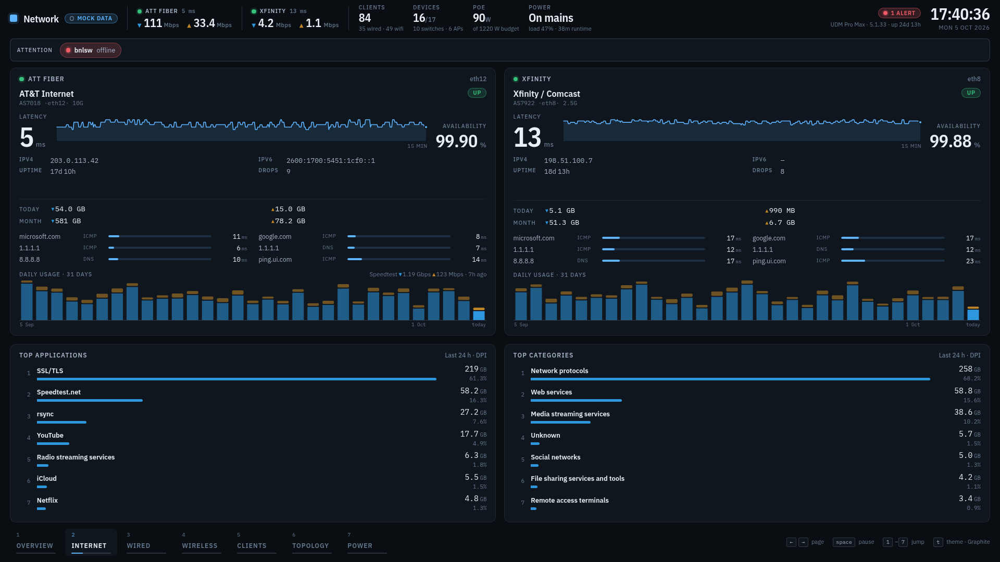
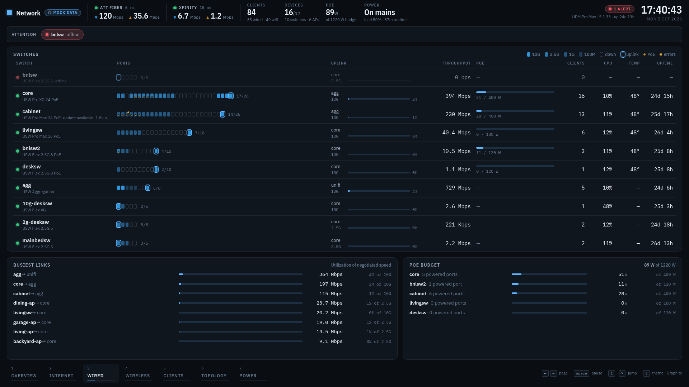
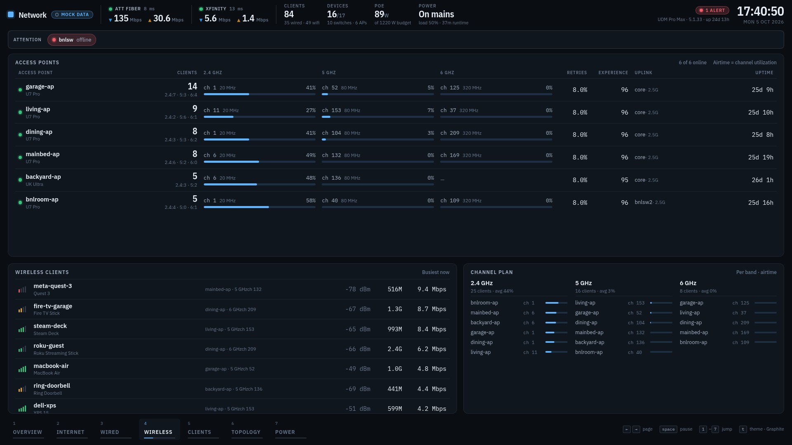
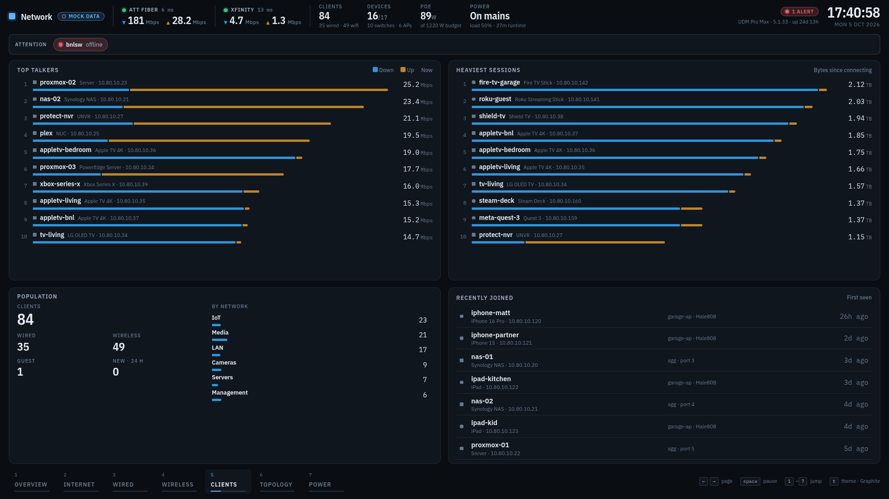
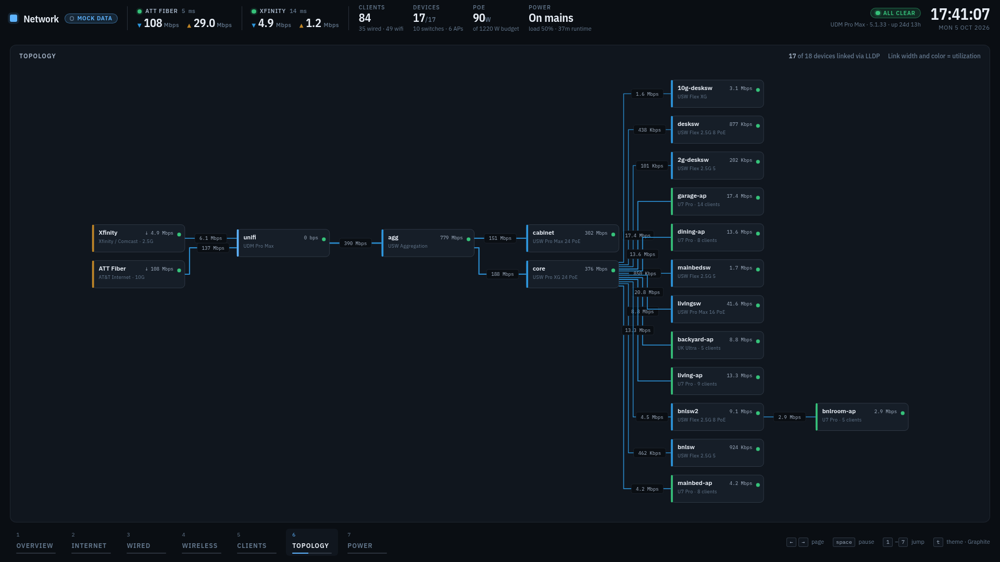
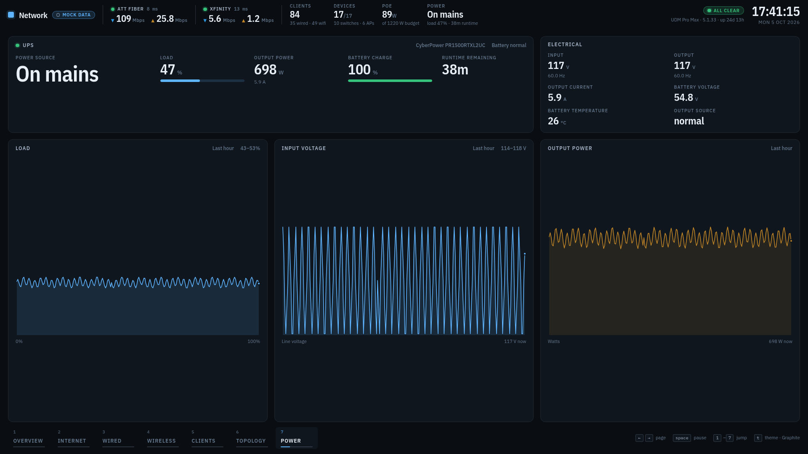

# panel

A network operations dashboard for a Ubiquiti UDM Pro Max site, built to run full-screen on a wall display (Chromium kiosk) or behind a reverse proxy as a web app.



One persistent status bar answers "is everything OK" from across the room: live download/upload per WAN, client and device counts, PoE draw, UPS state, and an alert count. Anything that needs attention (a device offline, a WAN down or slow, a saturated link, a congested radio, PoE near budget, UPS on battery) appears in an attention strip above the page, whichever page is showing. Below it, seven pages rotate.

## Pages

| | |
| --- | --- |
| **Internet** — each uplink in depth: latency trend, availability, controller probes, speedtest, 31 days of daily usage; top applications and categories (DPI, 24 h) | **Wired** — every switch as one row: port map (speed, PoE, uplink, errors), uplink utilization, throughput, PoE budget, CPU, temperature, uptime; busiest links; PoE headroom |
|  |  |
| **Wireless** — every AP as one row with clients, channel and airtime per band, retries, experience score, uplink; busiest wireless clients with signal; channel plan | **Clients** — top talkers now, heaviest sessions, population by network, recently joined |
|  |  |
| **Topology** — LLDP graph, left to right from the WANs; link width and color follow utilization | **Power** — UPS source, load, charge, runtime, electrical detail, last-hour trends (shown only when a UPS is configured) |
|  |  |

Screenshots are from mock mode, which synthesizes a fleet modeled on the real site (gateway, aggregation + core + cabinet switches, seven leaf switches, six APs, ~85 clients, a UPS) so nothing real leaks into the repo.

## What changed in the redesign

The previous HUD-style UI was replaced in October 2026; the full list is in [CHANGELOG.md](./CHANGELOG.md). In short:

- A fixed status bar and an exceptions strip, so the key numbers never rotate away and problems surface on every page.
- Labeled page tabs with a dwell progress line; rotation order, dwell and a pinned page are configurable per screen.
- Fleet-scale tables: one row per switch with a port map, one row per AP with per-band airtime, instead of a card per device.
- Server-side histories, 31-day daily usage, and a persisted event log, so sparklines, usage charts and "what happened" are full the moment a kiosk loads.
- Richer device and client data by merging the controller's v2 and legacy endpoints (PoE budgets, port error counters, client ↔ AP / switch-port association, per-band client counts, product names).
- A restrained design system (IBM Plex, hairline panels, validated data colors, status colors always with a label) that scales from 1080p to 4K.
- Kiosks reload themselves after a server upgrade.

## Architecture

Two npm workspaces:

- `server/` — Fastify + native `ws`. Polls the UDM (SNMP + controller API) and an optional UPS (SNMP), holds the canonical state plus short histories and an event log, and pushes ticks over a WebSocket at `/ws`.
- `web/` — SvelteKit (static adapter, Svelte 5 runes) + Tailwind v4. Renders the live stream; no server-side rendering.

In production the server serves the built web app from `/`. In dev, Vite runs on `:5173` and proxies `/api` and `/ws` to the server on `:4000`.

Wire types are defined once in `server/src/types.ts`; `web/src/lib/types.ts` re-exports them (type-only).

### Two UDM data sources, on purpose

- **SNMPv2c** drives the real-time WAN bandwidth chart and the usage accumulators. The legacy controller API caches WAN counters at ~30s, which is too slow for a live chart.
- **Legacy controller API** (local username/password) drives clients, DPI, device detail (ports, radios, PoE, LLDP, error counters) and health. Per-client rates are computed from byte deltas at a 60s cadence — anything faster races the controller's ~30s cache. Clients are fetched from both the v2 endpoint (names, fingerprints) and `/stat/sta` (AP / switch-port / radio association) and merged by MAC; devices likewise merge the v2 and legacy device lists.
- **Integration API key** alone works but is feature-limited: no DPI, no per-client rates, no device detail. Local creds unlock those.

The server advertises which subsystems are live in `features` so the UI degrades gracefully when something is missing.

### What the server keeps

- WAN throughput history (15 min at the 2s tick) and latency.
- Device, gateway and UPS sample histories (1 hour) so sparklines are full the moment a kiosk loads.
- Per-WAN usage: today, month-to-date and a 31-day daily series, accumulated from SNMP deltas and persisted to `data/monthly.json`.
- An event log (device offline/online, WAN down/up, public IP change, UPS on battery/mains, controller or SNMP outages) persisted to `data/events.json`.

## Getting started

Requires Node 20+ and a UDM (or run in mock mode for laptop dev).

```bash
cp .env.example .env        # edit credentials
npm install
npm run dev                 # http://localhost:5173
```

Without `UDM_HOST` and credentials the server boots in **mock mode** with the synthetic fleet described above, including 15 minutes of pre-filled history, 31 days of usage, a few seeded events, a switch that drops off periodically and a radio that gets congested, so the attention strip and event log can be seen working. Set `PANEL_MOCK=1` to force mock mode even with creds present.

To work on the UI against real data without credentials on your laptop, point the dev proxy at a deployed panel:

```bash
PANEL_UPSTREAM=https://panel.example.org npm run dev -w @panel/web
```

### Configuration

All config is environment variables read from `.env` at the repo root (or `/etc/panel/panel.env` for the Debian package). See [`.env.example`](./.env.example) for the full set. Highlights:

| Var | Purpose |
| --- | --- |
| `UDM_HOST` | UDM IP/hostname |
| `UDM_API_KEY` | Integration API key (clients, devices, current rates) |
| `UDM_USERNAME` / `UDM_PASSWORD` | Local admin (unlocks DPI, per-client rates, device detail) |
| `UDM_SNMP_COMMUNITY` | SNMPv2c community (enable on UDM under Settings → System → SNMP) |
| `UDM_WAN_IFINDEXES` | Comma-separated SNMP ifIndexes for WANs. Auto-detected if blank. |
| `UDM_WAN_LABELS` | Human-readable labels per WAN (matches index order) |
| `UDM_WAN_SPEEDS` | Plan/link speed per WAN in Mbps, for utilization displays |
| `UPS_HOST` | Network-managed UPS to poll over SNMP (enables the Power page) |
| `PANEL_SITE_NAME` | Name shown in the top bar |
| `PANEL_UI_PAGES` / `PANEL_UI_DWELL_MS` | Page rotation order and dwell |
| `PANEL_MOCK` | `1` to force synthetic data |
| `PORT` | HTTP port (default `4000`) |

### Kiosk controls

The kiosk URL accepts `?pages=overview,wired&dwell=30` to set the rotation, `?start=wired` to begin on a page, and `?page=wired` to pin one page (useful for a second screen). `?kiosk=1` hides the cursor; `?theme=arctic` picks a theme.

Keyboard: `←` / `→` step pages, `space` or `p` pauses the rotation, `1`–`9` jump to a page, `t` cycles the theme (Graphite, Arctic, Ember).

### Alerts

Alert thresholds live in one place, `web/src/lib/derive.ts` (`THRESHOLDS`): WAN latency and availability, link utilization, 5/6 GHz airtime and retries, device CPU/temperature, gateway CPU/memory/temperature, PoE budget, UPS load and charge. 2.4 GHz radios are excluded from airtime and retry alerts by default — on a crowded band carrying IoT devices, high utilization is the normal condition — but their meters still show on the Wireless page.

## Commands

```bash
npm run dev          # server + web in parallel (vite on 5173, server on 4000)
npm run build        # web → web/build, then server → server/dist
npm run start        # node server/dist/index.js (serves built web from /)
npm run typecheck    # both workspaces
```

There is no test suite. Typecheck is the only check.

## Design

The UI is a dark, low-chrome operations display: hairline panels, one UI accent, two data colors (download blue, upload amber — validated for color-blind separation on the dark surface), and reserved status colors that always travel with a label. Type is IBM Plex (Sans for UI, Sans Condensed for figures, Mono for addresses and columns), sized in `rem` off a viewport-scaled root so the same composition fits a 1080p panel and a 4K wall. Themes change the planes and accent only; data and status colors are the same everywhere.

To prevent LCD burn-in, `web/src/lib/burnInGuard.ts` drifts the whole UI by a few pixels every three minutes.

## Deploying

- **Debian package / apt** — `make deb` builds `build/panel_<version>_all.deb` (app under `/opt/panel`, `panel.service`, config in `/etc/panel/panel.env`); CI publishes to the 808 apt repo on push to `main`, and the Salt `panel` state keeps the host on the latest build. See `CLAUDE.md` for the layout.
- **VM / web app** — `deploy/install-vm.sh` installs a loopback-bound service; put Caddy or Apache in front (`deploy/reverse-proxy/`). `/ws` must be proxied as a WebSocket.
- **Kiosk display** — `deploy/install-plasma-kiosk.sh` sets up SDDM autologin → KDE Plasma → Chromium kiosk via `deploy/kiosk.sh` on a Pi; point `PANEL_URL` at the server. Ctrl+Alt+K toggles out to the desktop. The page reloads itself whenever the server it talks to is upgraded.

Service management:

```bash
sudo systemctl status panel
journalctl -u panel -f
```

### Quieter fan (Pi 4B)

`deploy/tmpfiles-panel-fan.conf` raises the pwm-fan trip points to 60/65/70/75 °C — the stock 40/45/50/55 °C is too twitchy for an always-on kiosk. The `dtparam=fan_temp*` keys in `/boot/firmware/config.txt` don't take effect on Pi OS Trixie, so this is applied via `systemd-tmpfiles` at every boot:

```bash
sudo cp deploy/tmpfiles-panel-fan.conf /etc/tmpfiles.d/panel-fan.conf
sudo systemd-tmpfiles --create /etc/tmpfiles.d/panel-fan.conf
```

## API

- `GET /api/snapshot` — current full state: WANs, histories, daily usage, clients, DPI, gateway, devices + device histories, gateway history, health, UPS + UPS history, events, features, UI config, build id.
- `GET /api/health` — `{ ok: true, ts }`.
- `WS /ws` — sends one `snapshot` message on connect, then `tick` messages on every poll (WAN samples every tick; clients, devices, histories, events and feature changes when they update).

## Refreshing the screenshots

With the mock dev server running (`npm run dev`) and a Chromium binary installed:

```bash
npm i --no-save puppeteer-core
node docs/screenshots.mjs            # writes docs/screenshots/<page>.png at 1920×1080
```

Set `CHROMIUM=/path/to/chromium` if it isn't at `/usr/bin/chromium`.
